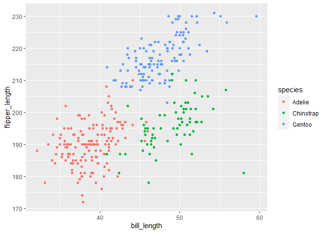

p8105\_hw1\_hq2182
================
Hanfei Qi

This is my solution to HW1.  
Load the tidyverse first.

``` r
library(tidyverse)
```

## Problem 1

Create a data frame with specific elements according to hw requirement.

``` r
prob1_df = 
  tibble(
    samp = rnorm(10),
    samp_gt_10 = samp > 0,
    char_vec = c("a", "b", "c", "d", "e", "f", "g", "h", "i", "j"),
    factor_vec = factor(c("low", "low", "low", "mod", "mod", "mod", "mod", "high", "high", "high"))
)

# Display the table
prob1_df
```

    ## # A tibble: 10 x 4
    ##        samp samp_gt_10 char_vec factor_vec
    ##       <dbl> <lgl>      <chr>    <fct>     
    ##  1 -0.692   FALSE      a        low       
    ##  2  1.56    TRUE       b        low       
    ##  3 -0.00634 FALSE      c        low       
    ##  4 -0.129   FALSE      d        mod       
    ##  5  0.933   TRUE       e        mod       
    ##  6 -0.463   FALSE      f        mod       
    ##  7 -0.240   FALSE      g        mod       
    ##  8 -0.0584  FALSE      h        high      
    ##  9  0.764   TRUE       i        high      
    ## 10 -0.856   FALSE      j        high

Take the mean of each variable in my data frame.  
The warning will not be displayed.

``` r
mean(pull(prob1_df, samp))
```

    ## [1] 0.08141485

``` r
mean(pull(prob1_df, samp_gt_10))
```

    ## [1] 0.3

``` r
mean(pull(prob1_df, char_vec))
```

    ## [1] NA

``` r
mean(pull(prob1_df, factor_vec))
```

    ## [1] NA

Conclusion: I can take the mean of numbers and logical but not character
or factor.

Try to convert the logical, character, and factor variables to numeric
variables.

``` r
as.numeric(pull(prob1_df, samp_gt_10))
as.numeric(pull(prob1_df, char_vec))
as.numeric(pull(prob1_df, factor_vec))
```

Conclusion: The logical and factor variables can be converted to numeric
variables, while the character variables cannot.

Convert variable’s type and multiply the random sample by the result.  
The warning will not be displayed.

``` r
as.numeric(pull(prob1_df, samp_gt_10)) * pull(prob1_df, samp)
```

    ##  [1] 0.0000000 1.5625624 0.0000000 0.0000000 0.9325848 0.0000000 0.0000000
    ##  [8] 0.0000000 0.7642364 0.0000000

``` r
as.factor(pull(prob1_df, samp_gt_10)) * pull(prob1_df, samp)
```

    ##  [1] NA NA NA NA NA NA NA NA NA NA

``` r
as.numeric(as.factor(pull(prob1_df, samp_gt_10))) * pull(prob1_df, samp)
```

    ##  [1] -0.692498154  3.125124714 -0.006337256 -0.128891862  1.865169570
    ##  [6] -0.462647253 -0.240171589 -0.058353912  1.528472786 -0.856335019

Conclusion: I can multiply numbers with numbers but not factors with
numbers.

## Problem 2

Firstly, load the library and penguins dataset.

``` r
library("palmerpenguins")
data("penguins", package = "palmerpenguins")
```

#### A short description of the penguins data set

  - The data set includes species, island, bill\_length\_mm,
    bill\_depth\_mm, flipper\_length\_mm, body\_mass\_g, sex, year of
    penguins.
  - Example values corresponding to variable names showed above: Adelie,
    Torgersen, 39.1, 18.7, 181, 3750, male, 2007.
  - There are 344 rows and 8 columns in this data set.
  - The mean of flipper length is 200.9152047 mm.

#### Scatterplot of flipper\_length\_mm (y) vs bill\_length\_mm (x)

#### The color indicates species

Create a new data frame to collect all information I need,  
then use ggplot to make a scatterplot.  
The scatterplot will be saved as a pdf file.

``` r
plot_df = tibble(
  bill_length = pull(penguins, bill_length_mm),
  flipper_length = pull(penguins, flipper_length_mm),
  species = pull(penguins, species))

ggplot(
  plot_df,
  aes(x = bill_length, y = flipper_length, color = species)) + geom_point()
```

<!-- -->

``` r
ggsave("p8105_hw1_scatter_plot_hq2182.pdf", height = 4, width = 6)
```
